# ПОЯСНИТЕЛЬНАЯ ЗАПИСКА
## К курсовой работе по программированию

**Тема:** Информационная система управления данными высшего учебного заведения

**Разработчик:** [ФИО студента]  
**Группа:** [Номер группы]  
**Год:** 2024

---

## ОГЛАВЛЕНИЕ

1. [Постановка задачи](#1-постановка-задачи)
2. [Описание классов](#2-описание-классов)
3. [Взаимосвязь классов](#3-взаимосвязь-классов)
4. [Описание алгоритмов](#4-описание-алгоритмов)
5. [Описание разработанного приложения](#5-описание-разработанного-приложения)
6. [Тестирование](#6-тестирование)
7. [Заключение](#7-заключение)
8. [Список использованной литературы](#8-список-использованной-литературы)
9. [Приложение. Листинг программы](#9-приложение-листинг-программы)

---

## 1. ПОСТАНОВКА ЗАДАЧИ

### 1.1 Назначение приложения

Информационная система управления данными высшего учебного заведения разработана для автоматизации процессов учета и управления данными образовательного процесса в университете. Приложение предназначено для ведения учета факультетов, кафедр, учебных групп, студентов, преподавателей, дисциплин, учебной нагрузки и дипломных работ.

### 1.2 Входные данные

Входными данными системы являются:
- Информация о факультетах (название, декан)
- Данные о кафедрах (название, заведующий, принадлежность к факультету)
- Сведения об учебных группах (номер, год набора, курс, факультет)
- Личные данные студентов (ФИО, группа)
- Информация о преподавателях (ФИО, должность, ученая степень, звание, кафедра)
- Учебные дисциплины (название, курс, семестр, количество часов, форма контроля)
- Учебная нагрузка преподавателей (преподаватель, дисциплина, группа, тип занятий, часы)
- Дипломные работы (тема, студент, научный руководитель, год, оценка)
- Оценки студентов по дисциплинам (баллы за семестр и экзамен/зачет)

### 1.3 Выходные данные

Результатом работы программы является:
- Структурированное отображение всех данных в удобном графическом интерфейсе
- Автоматическое сохранение всех данных в текстовые файлы для последующего использования
- Профили студентов с информацией о пройденных, текущих и будущих дисциплинах
- Профили преподавателей с перечнем ведомых дисциплин
- Автоматический расчет итоговых оценок на основе баллов
- Определение текущего семестра на основе времени года

### 1.4 Особенности задачи

При разработке приложения необходимо учитывать следующие особенности:
- Использование объектно-ориентированного подхода с применением паттерна MVVM
- Обеспечение валидации всех вводимых данных
- Реализация бизнес-правил (например, один преподаватель на лекции/семинары для группы)
- Автоматическое вычисление курса на основе семестра
- Определение текущего семестра с учетом времени года
- Система оценивания с различными шкалами для экзаменов и зачетов
- Группировка данных для удобного отображения (факультеты → кафедры, факультеты → группы → студенты)
- Сохранение данных в текстовые файлы для обеспечения персистентности

---

## 2. ОПИСАНИЕ КЛАССОВ

### 2.1 Модели данных (Models)

#### 2.1.1 Класс `Faculty`

**Назначение класса:** Представляет факультет университета.

**Данные-элементы класса:**
- `Guid Id` - уникальный идентификатор факультета
- `string Name` - название факультета
- `string Dean` - ФИО декана
- `List<Guid> GroupIds` - список идентификаторов групп факультета
- `List<Guid> DepartmentIds` - список идентификаторов кафедр факультета

**Операции и функции-утилиты:**
- `ToFileString()` - преобразование объекта в строку для сохранения в файл
- `FromFileString(string line)` - создание объекта из строки файла
- `ToString()` - строковое представление объекта

**Интерфейс класса:**
```csharp
public class Faculty : ReactiveObject
{
    public Guid Id { get; set; }
    public string Name { get; set; }
    public string Dean { get; set; }
    public List<Guid> GroupIds { get; set; }
    public List<Guid> DepartmentIds { get; set; }
    
    public string ToFileString()
    public static Faculty FromFileString(string line)
    public override string ToString()
}
```

#### 2.1.2 Класс `Department`

**Назначение класса:** Представляет кафедру, принадлежащую факультету.

**Данные-элементы класса:**
- `Guid Id` - уникальный идентификатор кафедры
- `string Name` - название кафедры
- `string Head` - ФИО заведующего кафедрой
- `Guid FacultyId` - идентификатор факультета
- `List<Guid> TeacherIds` - список идентификаторов преподавателей кафедры

**Операции и функции-утилиты:**
- `ToFileString()` - сохранение в файл
- `FromFileString(string line)` - загрузка из файла
- `ToString()` - строковое представление

#### 2.1.3 Класс `Group`

**Назначение класса:** Представляет учебную группу студентов.

**Данные-элементы класса:**
- `Guid Id` - уникальный идентификатор группы
- `string Number` - номер группы
- `int YearOfAdmission` - год набора
- `int Course` - текущий курс
- `Guid FacultyId` - идентификатор факультета
- `List<Guid> StudentIds` - список идентификаторов студентов группы

**Операции и функции-утилиты:**
- `ToFileString()` - сохранение в файл
- `FromFileString(string line)` - загрузка из файла
- `ToString()` - строковое представление

#### 2.1.4 Класс `Student`

**Назначение класса:** Представляет студента университета.

**Данные-элементы класса:**
- `Guid Id` - уникальный идентификатор студента
- `string LastName` - фамилия
- `string FirstName` - имя
- `string MiddleName` - отчество
- `Guid GroupId` - идентификатор группы
- `string RecordBookNumber` - номер зачетной книжки
- `double GPA` - средний балл

**Операции и функции-утилиты:**
- `ToFileString()` - сохранение в файл
- `FromFileString(string line)` - загрузка из файла
- `string FullName` - свойство для получения полного имени

#### 2.1.5 Класс `Teacher`

**Назначение класса:** Представляет преподавателя университета.

**Данные-элементы класса:**
- `Guid Id` - уникальный идентификатор преподавателя
- `string LastName` - фамилия
- `string FirstName` - имя
- `string MiddleName` - отчество
- `TeacherPosition Position` - должность (enum)
- `AcademicDegree Degree` - ученая степень (enum)
- `AcademicTitle Title` - ученое звание (enum)
- `Guid DepartmentId` - идентификатор кафедры
- `bool IsPostgraduate` - обучается в аспирантуре
- `bool LeadsResearchTopics` - руководит научными темами
- `bool LeadsResearchDirections` - руководит научными направлениями

**Операции и функции-утилиты:**
- `ToFileString()` - сохранение в файл
- `FromFileString(string line)` - загрузка из файла
- `string FullName` - полное имя
- `string FullInfo` - полная информация с должностью и званиями
- `bool IsPositionValid()` - проверка корректности должности и звания
- `bool CanTeachLectures()` - может ли читать лекции
- `bool CanTeachLaboratory()` - может ли проводить лабораторные работы

#### 2.1.6 Класс `Discipline`

**Назначение класса:** Представляет учебную дисциплину, привязанную к конкретной группе.

**Данные-элементы класса:**
- `Guid Id` - уникальный идентификатор дисциплины
- `string Name` - название дисциплины
- `int Course` - курс (вычисляется автоматически)
- `int Semester` - семестр (1-10)
- `int LectureHours` - количество часов лекций
- `int SeminarHours` - количество часов семинаров
- `int LaboratoryHours` - количество часов лабораторных работ
- `ControlForm ControlForm` - форма контроля (enum: Exam, Pass, DifferentiatedPass)
- `Guid GroupId` - идентификатор группы

**Операции и функции-утилиты:**
- `static int CalculateCourseFromSemester(int semester)` - вычисление курса по семестру
- `void SetSemester(int semester)` - установка семестра с автоматическим пересчетом курса
- `ToFileString()` - сохранение в файл
- `FromFileString(string line)` - загрузка из файла

**Алгоритм вычисления курса:**
```
Курс = (Семестр + 1) / 2
Примеры: 1-2 семестр → 1 курс, 3-4 семестр → 2 курс, 5-6 семестр → 3 курс
```

#### 2.1.7 Класс `WorkLoad`

**Назначение класса:** Представляет учебную нагрузку преподавателя по конкретной дисциплине для группы.

**Данные-элементы класса:**
- `Guid Id` - уникальный идентификатор нагрузки
- `Guid TeacherId` - идентификатор преподавателя
- `Guid DisciplineId` - идентификатор дисциплины
- `Guid GroupId` - идентификатор группы
- `LessonType LessonType` - тип занятий (enum: Lecture, Seminar, Laboratory)
- `int Hours` - количество часов
- `string AcademicYear` - учебный год (формат: "2024/2025")
- `int Semester` - семестр

**Операции и функции-утилиты:**
- `ToFileString()` - сохранение в файл
- `FromFileString(string line)` - загрузка из файла

#### 2.1.8 Класс `ThesisWork`

**Назначение класса:** Представляет дипломную работу студента.

**Данные-элементы класса:**
- `Guid Id` - уникальный идентификатор работы
- `string Title` - тема работы
- `Guid StudentId` - идентификатор студента
- `Guid SupervisorId` - идентификатор научного руководителя
- `int Year` - год защиты
- `int? Grade` - оценка (2-5, nullable)

**Операции и функции-утилиты:**
- `ToFileString()` - сохранение в файл
- `FromFileString(string line)` - загрузка из файла

#### 2.1.9 Класс `StudentGrade`

**Назначение класса:** Представляет оценку студента по дисциплине с автоматическим расчетом итоговой оценки.

**Данные-элементы класса:**
- `Guid Id` - уникальный идентификатор оценки
- `Guid StudentId` - идентификатор студента
- `Guid DisciplineId` - идентификатор дисциплины
- `int SemesterPoints` - баллы за семестр (макс: 60 для экзамена, 80 для зачета)
- `int ExamPoints` - баллы на экзамене/зачете (макс: 40 для экзамена, 20 для зачета)
- `int TotalPoints` - общая сумма баллов
- `string Grade` - итоговая оценка в текстовом виде

**Операции и функции-утилиты:**
- `void CalculateGrade(ControlForm controlForm)` - расчет итоговой оценки
- `ToFileString()` - сохранение в файл
- `FromFileString(string line)` - загрузка из файла

**Алгоритм расчета оценки:**
- Для экзамена/дифзачета: 0-49 → "2", 50-72 → "3", 73-86 → "4", 87-100 → "5"
- Для зачета: 0-49 → "Незачет", 50-100 → "Зачет"

#### 2.1.10 Класс `TeacherDiscipline`

**Назначение класса:** Связывает преподавателя с дисциплиной, которую он может вести.

**Данные-элементы класса:**
- `Guid Id` - уникальный идентификатор связи
- `Guid TeacherId` - идентификатор преподавателя
- `Guid DisciplineId` - идентификатор дисциплины

**Операции и функции-утилиты:**
- `ToFileString()` - сохранение в файл
- `FromFileString(string line)` - загрузка из файла

### 2.2 ViewModels (Model-View-ViewModel)

#### 2.2.1 Класс `ViewModelBase`

**Назначение класса:** Базовый класс для всех ViewModel, обеспечивает поддержку реактивного программирования.

**Наследование:** `ReactiveObject` (из библиотеки ReactiveUI)

#### 2.2.2 Класс `MainWindowViewModel`

**Назначение класса:** Координирует работу всех разделов приложения и управляет навигацией.

**Данные-элементы класса:**
- `DataService _dataService` - сервис для работы с данными
- `ViewModelBase _currentPage` - текущая открытая страница
- Свойства для всех ViewModel разделов

**Операции:**
- `ShowStudentProfile(Student student)` - открытие профиля студента
- `ShowTeacherProfile(Teacher teacher)` - открытие профиля преподавателя
- `OnClosing()` - сохранение данных при закрытии

#### 2.2.3 Классы ViewModel для разделов

Для каждого раздела приложения создан отдельный ViewModel:
- `FacultiesViewModel` - управление факультетами
- `DepartmentsViewModel` - управление кафедрами
- `GroupsViewModel` - управление группами
- `StudentsViewModel` - управление студентами
- `TeachersViewModel` - управление преподавателями
- `DisciplinesViewModel` - управление дисциплинами
- `WorkLoadsViewModel` - управление учебной нагрузкой
- `ThesisWorksViewModel` - управление дипломными работами
- `StudentProfileViewModel` - профиль студента
- `TeacherProfileViewModel` - профиль преподавателя
- `GradeInputViewModel` - ввод оценок

Каждый ViewModel содержит:
- Свойства для отображения данных
- Команды для добавления, редактирования, удаления
- Валидацию данных
- Логику группировки данных (где необходимо)

### 2.3 Сервисы (Services)

#### 2.3.1 Класс `DataService`

**Назначение класса:** Центральный сервис для загрузки и сохранения всех данных приложения.

**Данные-элементы класса:**
- `ObservableCollection<Faculty> Faculties` - коллекция факультетов
- `ObservableCollection<Department> Departments` - коллекция кафедр
- `ObservableCollection<Group> Groups` - коллекция групп
- `ObservableCollection<Student> Students` - коллекция студентов
- `ObservableCollection<Teacher> Teachers` - коллекция преподавателей
- `ObservableCollection<Discipline> Disciplines` - коллекция дисциплин
- `ObservableCollection<WorkLoad> WorkLoads` - коллекция нагрузок
- `ObservableCollection<ThesisWork> ThesisWorks` - коллекция дипломных работ
- `ObservableCollection<StudentGrade> Grades` - коллекция оценок
- `ObservableCollection<TeacherDiscipline> TeacherDisciplines` - связи преподавателей и дисциплин

**Операции:**
- `void LoadAllData()` - загрузка всех данных из файлов
- `void SaveAllData()` - сохранение всех данных в файлы
- Методы загрузки/сохранения для каждого типа данных
- Вспомогательные методы `Get*()` для поиска объектов по ID

### 2.4 Вспомогательные классы (Helpers)

#### 2.4.1 Класс `ValidationHelper`

**Назначение класса:** Статический класс для валидации вводимых данных.

**Операции:**
- `bool IsValidName(string? name)` - проверка имени (только буквы)
- `bool IsValidNameWithNumbers(string? name)` - проверка названия (буквы и цифры)
- `bool IsValidYear(string? year)` - проверка года (1900-2100)
- `bool IsValidCourse(string? course)` - проверка курса (1-6)
- `bool IsValidSemester(string? semester)` - проверка семестра (1-10)
- `bool IsValidHours(string? hours)` - проверка часов (1-1000)
- `string GetErrorMessage(string fieldName, string errorType)` - получение сообщения об ошибке

#### 2.4.2 Класс `EnumHelper`

**Назначение класса:** Вспомогательный класс для создания списков enum значений с русскими названиями.

**Операции:**
- `List<EnumItem<T>> GetTeacherPositions()` - список должностей
- `List<EnumItem<T>> GetAcademicDegrees()` - список степеней
- `List<EnumItem<T>> GetAcademicTitles()` - список званий
- `List<EnumItem<T>> GetLessonTypes()` - список типов занятий
- `List<EnumItem<T>> GetControlForms()` - список форм контроля

---

## 3. ВЗАИМОСВЯЗЬ КЛАССОВ

### 3.1 Иерархия наследования

```
ReactiveObject (из ReactiveUI)
    ├── ViewModelBase
    │   ├── MainWindowViewModel
    │   ├── FacultiesViewModel
    │   ├── DepartmentsViewModel
    │   ├── GroupsViewModel
    │   ├── StudentsViewModel
    │   ├── TeachersViewModel
    │   ├── DisciplinesViewModel
    │   ├── WorkLoadsViewModel
    │   ├── ThesisWorksViewModel
    │   ├── StudentProfileViewModel
    │   ├── TeacherProfileViewModel
    │   └── GradeInputViewModel
    │
    └── Models (все модели данных)
        ├── Faculty
        ├── Department
        ├── Group
        ├── Student
        ├── Teacher
        ├── Discipline
        ├── WorkLoad
        ├── ThesisWork
        ├── StudentGrade
        └── TeacherDiscipline
```

### 3.2 Композиция и связи

**Структура данных:**

```
Faculty (Факультет)
    ├── Department[] (Кафедры)
    │   └── Teacher[] (Преподаватели)
    │
    └── Group[] (Группы)
        ├── Student[] (Студенты)
        │   ├── StudentGrade[] (Оценки)
        │   └── ThesisWork (Дипломная работа)
        │       └── Teacher (Научный руководитель)
        │
        └── Discipline[] (Дисциплины)
            ├── StudentGrade[] (Оценки студентов)
            └── WorkLoad[] (Нагрузка преподавателей)
                └── Teacher (Преподаватель)
                    └── TeacherDiscipline[] (Дисциплины преподавателя)
```

**Связи между классами:**
- `Faculty` → `Department` (один ко многим)
- `Faculty` → `Group` (один ко многим)
- `Department` → `Teacher` (один ко многим)
- `Group` → `Student` (один ко многим)
- `Group` → `Discipline` (один ко многим)
- `Student` → `StudentGrade` (один ко многим)
- `Student` → `ThesisWork` (один к одному)
- `Teacher` → `WorkLoad` (один ко многим)
- `Teacher` → `TeacherDiscipline` (один ко многим)
- `Discipline` → `StudentGrade` (один ко многим)
- `Discipline` → `WorkLoad` (один ко многим)
- `Discipline` → `TeacherDiscipline` (один ко многим)

### 3.3 Зависимости ViewModel

Все ViewModel зависят от `DataService`, который предоставляет доступ к данным. `MainWindowViewModel` координирует работу всех остальных ViewModel и управляет навигацией между разделами.

### 3.4 Диаграмма классов

*Рисунок 12 - Диаграмма классов и их взаимосвязей*

**Диаграмма основных классов и их связей:**

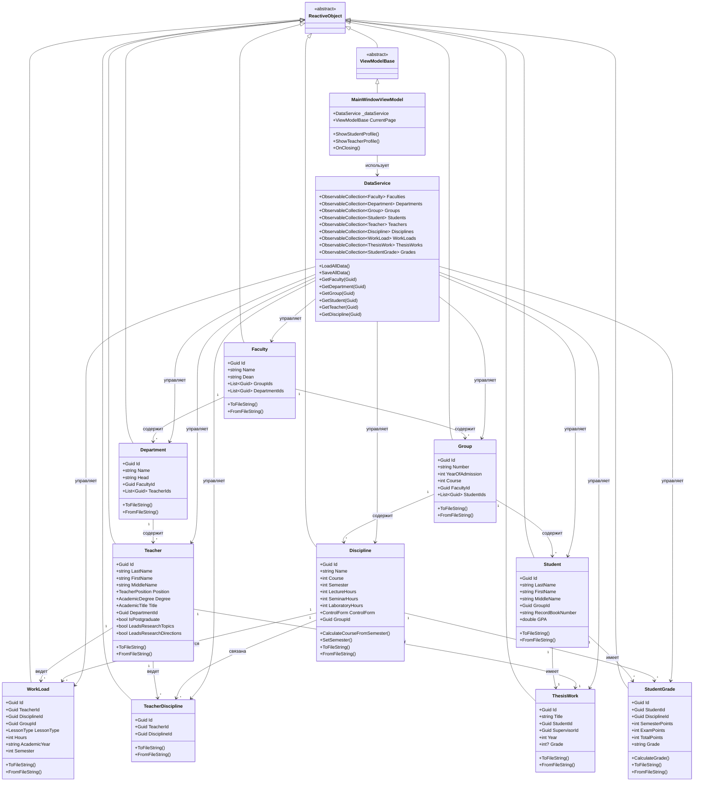

---

## 4. ОПИСАНИЕ АЛГОРИТМОВ

### 4.1 Алгоритм расчета курса на основе семестра

**Входные данные:** Номер семестра (1-10)

**Выходные данные:** Номер курса (1-5)

**Алгоритм:**
```
1. Принять номер семестра
2. Вычислить курс по формуле: Курс = (Семестр + 1) / 2
3. Вернуть результат
```

**Примеры:**
- Семестр 1 → (1+1)/2 = 1 курс
- Семестр 2 → (2+1)/2 = 1 курс
- Семестр 3 → (3+1)/2 = 2 курс
- Семестр 4 → (4+1)/2 = 2 курс
- Семестр 5 → (5+1)/2 = 3 курс

**Блок-схема алгоритма:**

*Рисунок 1 - Алгоритм расчета курса на основе семестра*

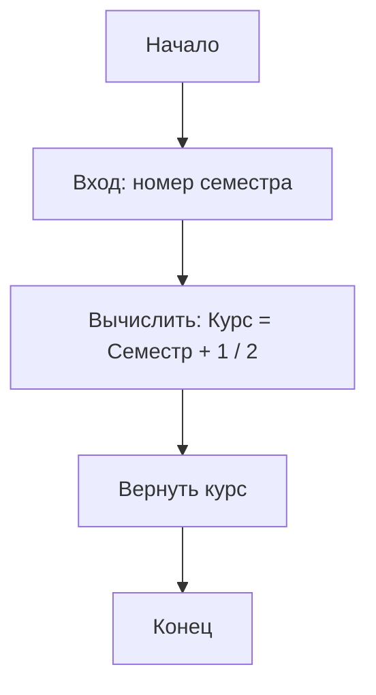

**Реализация:** Метод `Discipline.CalculateCourseFromSemester(int semester)`

### 4.2 Алгоритм определения текущего семестра

**Входные данные:** Текущая дата, курс группы

**Выходные данные:** Номер текущего семестра

**Алгоритм:**
```
1. Получить текущий месяц (DateTime.Now.Month)
2. Определить половину учебного года:
   - Если месяц >= 9 ИЛИ месяц <= 1: первая половина (нечетный семестр)
   - Иначе: вторая половина (четный семестр)
3. Вычислить семестр:
   - Если первая половина: Семестр = Курс * 2 - 1
   - Если вторая половина: Семестр = Курс * 2
4. Вернуть результат
```

**Логика:**
- Сентябрь (9) - Январь (1): нечетные семестры (1, 3, 5, 7, 9)
- Февраль (2) - Август (8): четные семестры (2, 4, 6, 8, 10)

**Примеры:**
- Курс 1, месяц 10 (октябрь) → 1*2-1 = 1 семестр
- Курс 1, месяц 3 (март) → 1*2 = 2 семестр
- Курс 2, месяц 11 (ноябрь) → 2*2-1 = 3 семестр
- Курс 2, месяц 5 (май) → 2*2 = 4 семестр

**Блок-схема алгоритма:**

*Рисунок 2 - Алгоритм определения текущего семестра*

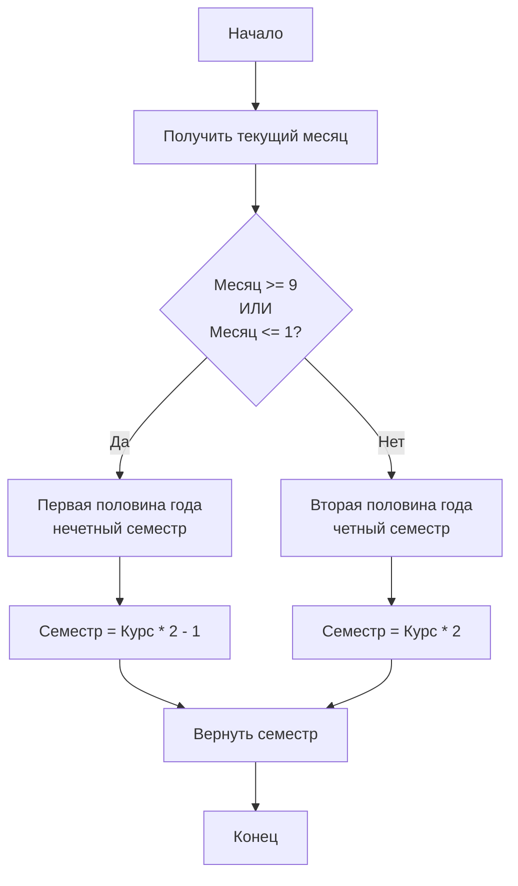

**Реализация:** Метод `StudentProfileViewModel.LoadStudentData()`

### 4.3 Алгоритм расчета итоговой оценки

**Входные данные:** Баллы за семестр, баллы на экзамене/зачете, форма контроля

**Выходные данные:** Итоговая оценка в текстовом виде

**Алгоритм:**
```
1. Вычислить общую сумму баллов: TotalPoints = SemesterPoints + ExamPoints
2. Определить форму контроля:
   
   ЕСЛИ форма контроля = Экзамен ИЛИ Дифференцированный зачет:
       ЕСЛИ TotalPoints < 50:
           Оценка = "Неудовлетворительно (2)"
       ИНАЧЕ ЕСЛИ TotalPoints <= 72:
           Оценка = "Удовлетворительно (3)"
       ИНАЧЕ ЕСЛИ TotalPoints <= 86:
           Оценка = "Хорошо (4)"
       ИНАЧЕ:
           Оценка = "Отлично (5)"
   
   ИНАЧЕ (форма контроля = Зачет):
       ЕСЛИ TotalPoints >= 50:
           Оценка = "Зачет"
       ИНАЧЕ:
           Оценка = "Незачет"
3. Вернуть оценку
```

**Шкала оценивания:**
- **Экзамен/Дифзачет:** 0-49 → "2", 50-72 → "3", 73-86 → "4", 87-100 → "5"
- **Зачет:** 0-49 → "Незачет", 50-100 → "Зачет"

**Максимальные баллы:**
- Экзамен: 60 (семестр) + 40 (экзамен) = 100
- Зачет/Дифзачет: 80 (семестр) + 20 (зачет) = 100

**Блок-схема алгоритма:**

*Рисунок 3 - Алгоритм расчета итоговой оценки*

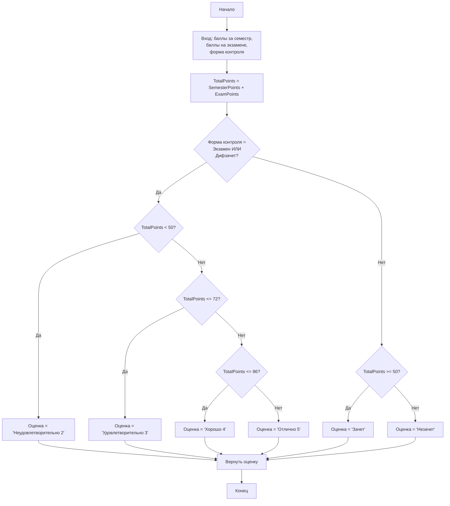

**Реализация:** Метод `StudentGrade.CalculateGrade(ControlForm controlForm)`

### 4.4 Алгоритм группировки данных

#### 4.4.1 Группировка студентов по факультетам и группам

**Входные данные:** Список всех студентов, список всех групп, список всех факультетов

**Выходные данные:** Иерархическая структура: Факультет → Группа → Студенты

**Алгоритм:**
```
1. Сгруппировать студентов по GroupId
2. Для каждой группы:
   a. Найти группу по GroupId
   b. Найти факультет группы
   c. Создать структуру: Факультет → Группа → Студенты
3. Сгруппировать по факультетам
4. Отсортировать факультеты по названию
5. Отсортировать группы по номеру
6. Отсортировать студентов по ФИО
7. Вернуть иерархическую структуру
```

**Блок-схема алгоритма:**

*Рисунок 4 - Алгоритм группировки студентов по факультетам и группам*

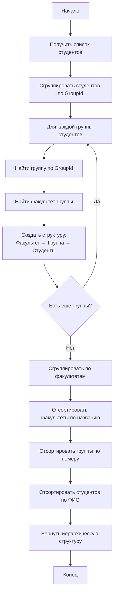

**Реализация:** Метод `StudentsViewModel.UpdateGroupedStudents()`

#### 4.4.2 Группировка дисциплин по группам

**Входные данные:** Список всех дисциплин, список всех групп

**Выходные данные:** Структура: Группа → Дисциплины

**Алгоритм:**
```
1. Сгруппировать дисциплины по GroupId
2. Для каждой группы:
   a. Найти группу по GroupId
   b. Создать структуру: Группа → Дисциплины
3. Отсортировать группы по номеру
4. Отсортировать дисциплины по семестру и названию
5. Вернуть структуру
```

**Блок-схема алгоритма:**

*Рисунок 5 - Алгоритм группировки дисциплин по группам*

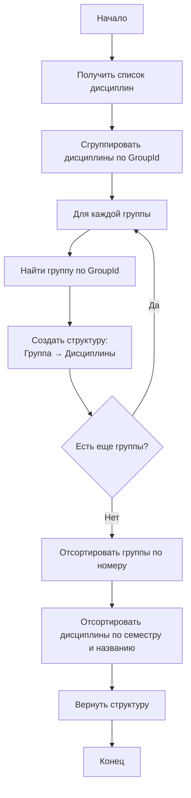

**Реализация:** Метод `DisciplinesViewModel.UpdateGroupedDisciplines()`

### 4.5 Алгоритм валидации данных

**Входные данные:** Поле для валидации, тип валидации

**Выходные данные:** Результат валидации (true/false), сообщение об ошибке

**Алгоритм валидации имени:**
```
1. Проверить, что строка не пустая
2. Проверить регулярным выражением: только буквы (русские и латинские), пробелы, дефисы, точки
3. Вернуть результат
```

**Блок-схема валидации имени:**

*Рисунок 6 - Алгоритм валидации имени*

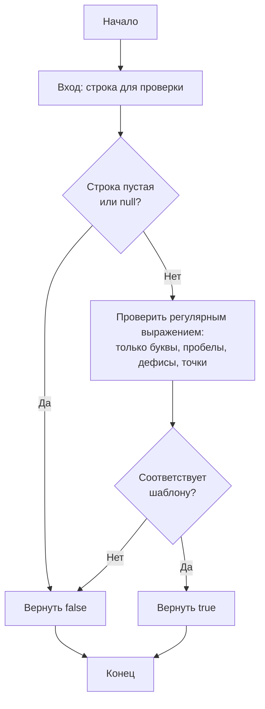

**Алгоритм валидации года:**
```
1. Проверить, что строка не пустая
2. Попытаться преобразовать в число
3. Проверить диапазон: 1900 <= год <= 2100
4. Вернуть результат
```

**Блок-схема валидации года:**

*Рисунок 7 - Алгоритм валидации года*

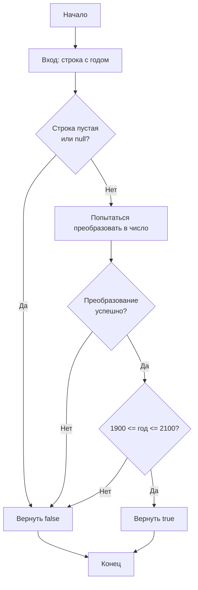

**Алгоритм валидации курса/семестра:**
```
1. Проверить, что строка не пустая
2. Попытаться преобразовать в число
3. Проверить диапазон:
   - Курс: 1 <= курс <= 6
   - Семестр: 1 <= семестр <= 10
4. Вернуть результат
```

**Блок-схема валидации курса/семестра:**

*Рисунок 8 - Алгоритм валидации курса/семестра*

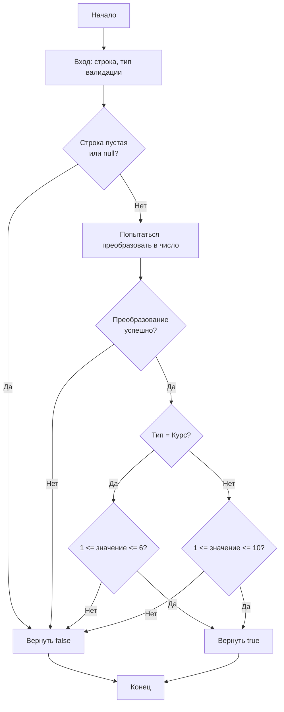

**Реализация:** Класс `ValidationHelper`

### 4.6 Алгоритм сохранения и загрузки данных

**Алгоритм сохранения:**
```
1. Для каждой коллекции данных:
   a. Преобразовать каждый объект в строку (метод ToFileString())
   b. Записать все строки в файл
2. Сохранить файл в папку Data
```

**Алгоритм загрузки:**
```
1. Проверить существование файла
2. Прочитать все строки из файла
3. Для каждой строки:
   a. Пропустить пустые строки
   b. Создать объект из строки (метод FromFileString())
   c. Добавить объект в коллекцию
4. Обработать ошибки (некорректные строки игнорируются)
```

**Блок-схема алгоритма сохранения:**

*Рисунок 9 - Алгоритм сохранения данных в файлы*

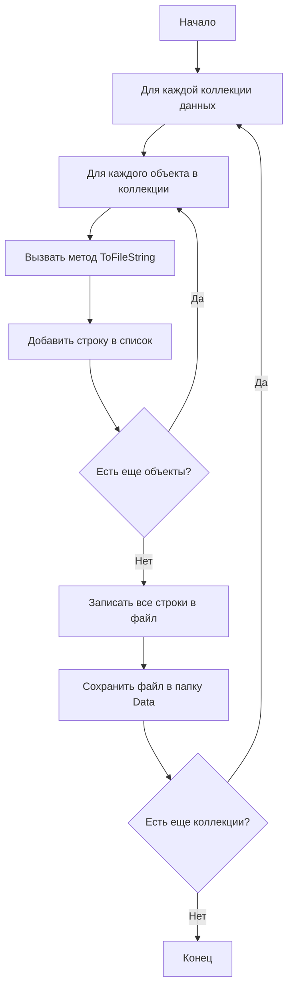

**Блок-схема алгоритма загрузки:**

*Рисунок 10 - Алгоритм загрузки данных из файлов*

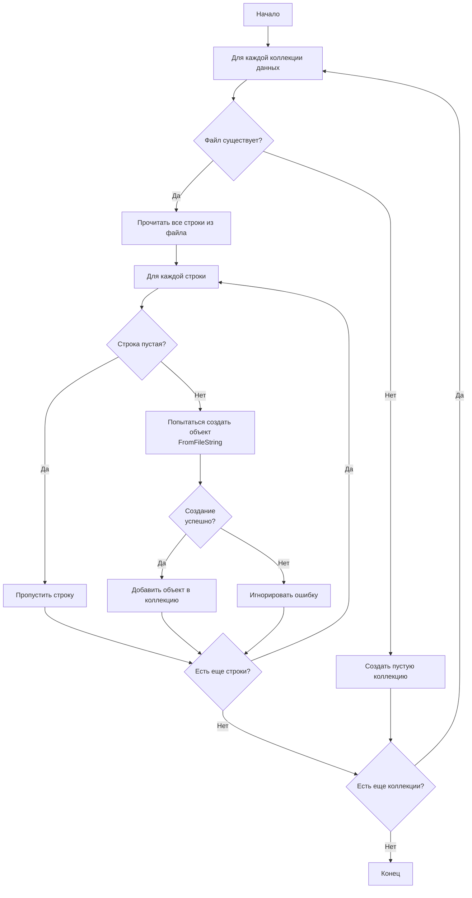

**Формат файла:** Разделитель полей - символ `|`

**Пример:** `faculties.txt`
```
Id|Название|Декан|GroupIds|DepartmentIds
```

**Реализация:** Класс `DataService`, методы `Load*()` и `Save*()`

### 4.7 Алгоритм добавления данных с валидацией

**Входные данные:** Данные для добавления (зависят от типа сущности)

**Выходные данные:** Результат операции (успех/ошибка), сообщение об ошибке

**Алгоритм:**
```
1. Очистить предыдущие сообщения об ошибках
2. Для каждого поля:
   a. Выполнить валидацию поля
   b. Если ошибка - добавить сообщение об ошибке
3. Если есть ошибки - вернуть ошибку
4. Проверить бизнес-правила
5. Если ошибка - вернуть ошибку
6. Создать новый объект
7. Добавить объект в коллекцию
8. Очистить поля ввода
9. Вернуть успех
```

**Блок-схема алгоритма:**

*Рисунок 11 - Алгоритм добавления данных с валидацией*

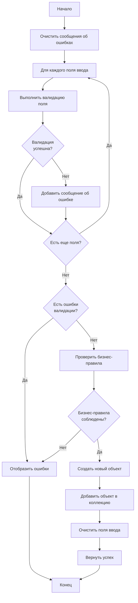

**Реализация:** Методы `Add*()` в соответствующих ViewModel

---

## 5. ОПИСАНИЕ РАЗРАБОТАННОГО ПРИЛОЖЕНИЯ

### 5.1 Общие сведения

Приложение представляет собой десктопное приложение с графическим интерфейсом, разработанное на языке C# с использованием фреймворка Avalonia UI. Приложение работает на платформах Windows, macOS и Linux.

### 5.2 Структура интерфейса

Главное окно приложения состоит из:
- **Боковое меню навигации** (слева) - для перехода между разделами
- **Область содержимого** (справа) - отображает выбранный раздел
- **Кнопка сохранения данных** - в верхней части главного окна

### 5.3 Разделы приложения

#### 5.3.1 Раздел "Факультеты"

**Назначение:** Управление факультетами университета.

**Функциональность:**
- Добавление нового факультета (название, декан)
- Редактирование существующего факультета
- Удаление факультета
- Отображение списка всех факультетов

**Валидация:**
- Название и ФИО декана должны содержать только буквы
- Поля не могут быть пустыми

#### 5.3.2 Раздел "Кафедры"

**Назначение:** Управление кафедрами с группировкой по факультетам.

**Функциональность:**
- Добавление кафедры (название, заведующий, факультет)
- Редактирование кафедры
- Удаление кафедры
- Группировка кафедр по факультетам для удобного просмотра

**Валидация:**
- Обязательный выбор факультета
- Название и ФИО заведующего должны содержать только буквы

#### 5.3.3 Раздел "Группы"

**Назначение:** Управление учебными группами с группировкой по факультетам и курсам.

**Функциональность:**
- Добавление группы (номер, год набора, курс, факультет)
- Редактирование группы
- Удаление группы
- Двухуровневая группировка: Факультет → Курс → Группы

**Валидация:**
- Номер группы может содержать буквы и цифры
- Год набора: 1900-2100
- Курс: 1-6
- Обязательный выбор факультета

#### 5.3.4 Раздел "Студенты"

**Назначение:** Управление студентами с группировкой по факультетам и группам.

**Функциональность:**
- Добавление студента (ФИО, группа)
- Редактирование студента
- Удаление студента
- Открытие профиля студента
- Двухуровневая группировка: Факультет → Группа → Студенты

**Валидация:**
- Фамилия и имя обязательны, только буквы
- Отчество необязательно
- Обязательный выбор группы

#### 5.3.5 Раздел "Преподаватели"

**Назначение:** Управление преподавательским составом.

**Функциональность:**
- Добавление преподавателя (ФИО, должность, степень, звание, кафедра)
- Редактирование преподавателя
- Удаление преподавателя
- Открытие профиля преподавателя
- Дополнительные параметры (аспирант, руководство темами)

**Валидация:**
- ФИО должно содержать только буквы
- Обязательный выбор кафедры

#### 5.3.6 Раздел "Дисциплины"

**Назначение:** Управление учебными дисциплинами с группировкой по группам.

**Функциональность:**
- Добавление дисциплины (название, семестр, часы, форма контроля, группа)
- Автоматическое вычисление курса на основе семестра
- Редактирование дисциплины
- Удаление дисциплины
- Группировка дисциплин по группам

**Валидация:**
- Семестр: 1-10
- Хотя бы один тип занятий должен иметь > 0 часов
- Обязательный выбор группы

#### 5.3.7 Раздел "Учебная нагрузка"

**Назначение:** Распределение учебной нагрузки преподавателей.

**Функциональность:**
- Добавление нагрузки (преподаватель, дисциплина, группа, тип занятий, часы, год, семестр)
- Редактирование нагрузки
- Удаление нагрузки
- Фильтрация дисциплин по преподавателю (только те, что он ведет)
- Валидация правила: один преподаватель на лекции/семинары для группы

**Валидация:**
- Обязательный выбор преподавателя, дисциплины, группы
- Часы: 1-1000
- Учебный год в формате ГГГГ/ГГГГ
- Семестр: 1-12
- Дисциплина должна быть у преподавателя
- Дисциплина должна быть привязана к группе

#### 5.3.8 Раздел "Дипломные работы"

**Назначение:** Учет выпускных квалификационных работ.

**Функциональность:**
- Добавление дипломной работы (тема, студент, научный руководитель, год, оценка)
- Редактирование работы
- Удаление работы
- Фильтрация научных руководителей (только те, кто может руководить)

**Валидация:**
- Обязательный выбор студента и научного руководителя
- Научный руководитель должен иметь право руководить работами
- Год: 1900-2100
- Оценка: 2-5 (если указана)

#### 5.3.9 Профиль студента

**Назначение:** Отображение информации о студенте и его успеваемости.

**Функциональность:**
- Отображение информации о студенте и его группе
- Показать текущий семестр (автоматически определяется)
- Разделение дисциплин на:
  - **Пройденные** (группировка по семестрам)
  - **Текущие** (дисциплины текущего семестра)
  - **Будущие** (дисциплины следующих семестров)
- Ввод/редактирование оценок по дисциплинам
- Автоматический расчет итоговой оценки

**Алгоритм работы:**
1. Определение текущего семестра на основе времени года
2. Фильтрация дисциплин группы по семестрам
3. Группировка пройденных дисциплин по семестрам
4. Отображение оценок для каждой дисциплины

#### 5.3.10 Профиль преподавателя

**Назначение:** Управление дисциплинами преподавателя.

**Функциональность:**
- Отображение информации о преподавателе
- Список дисциплин, которые ведет преподаватель
- Добавление дисциплины к преподавателю
- Удаление дисциплины у преподавателя
- Список доступных дисциплин для добавления

### 5.4 Работа с данными

#### 5.4.1 Сохранение данных

Данные сохраняются автоматически:
- При закрытии приложения
- По нажатию кнопки "СОХРАНИТЬ ДАННЫЕ"

Все данные сохраняются в текстовые файлы в папке `bin/Debug/net9.0/Data/`:
- `faculties.txt` - факультеты
- `departments.txt` - кафедры
- `groups.txt` - группы
- `students.txt` - студенты
- `teachers.txt` - преподаватели
- `disciplines.txt` - дисциплины
- `workloads.txt` - учебная нагрузка
- `thesisworks.txt` - дипломные работы
- `grades.txt` - оценки студентов
- `teacherdisciplines.txt` - связи преподавателей и дисциплин

#### 5.4.2 Загрузка данных

При запуске приложения все данные автоматически загружаются из файлов. Если файлы не существуют, создаются пустые коллекции.

#### 5.4.3 Формат файлов данных

Каждая строка файла представляет один объект. Поля разделены символом `|`.

**Пример формата `faculties.txt`:**
```
Id|Название|Декан|GroupIds|DepartmentIds
```

**Пример формата `students.txt`:**
```
Id|Фамилия|Имя|Отчество|GroupId|RecordBookNumber|GPA
```

### 5.5 Валидация данных

Система валидации проверяет все вводимые данные:

- **Имена и названия:** только буквы (русские и латинские), пробелы, дефисы, точки
- **Названия с цифрами:** буквы, цифры, пробелы, дефисы, точки
- **Годы:** диапазон 1900-2100
- **Курсы:** диапазон 1-6
- **Семестры:** диапазон 1-10
- **Часы:** диапазон 1-1000
- **Обязательные поля:** проверка на пустоту
- **Бизнес-правила:** проверка логических связей между данными

При ошибке валидации отображается красное сообщение с описанием проблемы.

### 5.6 Цветовая схема интерфейса

- **Боковое меню:** Темно-синий (#2c3e50)
- **Заголовки разделов:** Голубой (#3498db)
- **Заголовки групп:** Светло-голубой (#5dade2)
- **Кнопки добавления:** Зеленый (#27ae60)
- **Кнопки обновления:** Оранжевый (#f39c12)
- **Кнопки удаления:** Красный (#e74c3c)
- **Сообщения об ошибках:** Красный текст на розовом фоне (#ffebee)
- **Поля ввода:** Светло-серый фон (#F0F0F0), темно-серый текст (#2c3e50)
- **Выделение при наведении:** Светло-голубой (#E3F2FD)

---

## 6. ТЕСТИРОВАНИЕ

### 6.1 Контрольный пример 1: Создание структуры факультета

**Цель:** Проверить создание и связывание основных сущностей.

**Шаги:**
1. Добавить факультет "Инженерный факультет", декан "Иванов Иван Иванович"
2. Добавить кафедру "Кафедра информатики", заведующий "Петров Петр Петрович", факультет "Инженерный факультет"
3. Добавить группу "ИВТ-201", год набора 2020, курс 4, факультет "Инженерный факультет"
4. Добавить студента "Сидоров Сидор Сидорович", группа "ИВТ-201"

**Ожидаемый результат:**
- Факультет отображается в списке
- Кафедра отображается под факультетом в разделе "Кафедры"
- Группа отображается под факультетом в разделе "Группы"
- Студент отображается в группе "ИВТ-201" в разделе "Студенты"

**Результат:** ✅ Все операции выполнены успешно, данные корректно связаны и отображаются.

### 6.2 Контрольный пример 2: Добавление дисциплины и автоматический расчет курса

**Цель:** Проверить автоматическое вычисление курса на основе семестра.

**Шаги:**
1. Добавить дисциплину "Математический анализ", семестр 3, группа "ИВТ-201"
2. Проверить автоматически вычисленный курс

**Ожидаемый результат:**
- Курс автоматически установлен в 2 (так как семестр 3: (3+1)/2 = 2)

**Результат:** ✅ Курс вычислен корректно.

### 6.3 Контрольный пример 3: Ввод оценки и расчет итоговой оценки

**Цель:** Проверить алгоритм расчета итоговой оценки.

**Шаги:**
1. Открыть профиль студента "Сидоров Сидор Сидорович"
2. Выбрать дисциплину "Математический анализ" (экзамен)
3. Ввести баллы: семестр 55, экзамен 35
4. Проверить итоговую оценку

**Ожидаемый результат:**
- Общая сумма: 55 + 35 = 90 баллов
- Итоговая оценка: "Отлично (5)" (так как 90 > 87)

**Результат:** ✅ Оценка рассчитана корректно.

### 6.4 Контрольный пример 4: Валидация данных

**Цель:** Проверить работу системы валидации.

**Тесты:**
1. Попытка добавить факультет с названием "Факультет123" → ❌ Ошибка: "должно содержать только буквы"
2. Попытка добавить группу с годом "2250" → ❌ Ошибка: "должно быть в диапазоне 1900-2100"
3. Попытка добавить студента без выбора группы → ❌ Ошибка: "Необходимо выбрать группу"
4. Попытка добавить дисциплину с семестром 15 → ❌ Ошибка: "должно быть от 1 до 10"

**Результат:** ✅ Все проверки валидации работают корректно.

### 6.5 Контрольный пример 5: Определение текущего семестра

**Цель:** Проверить алгоритм определения текущего семестра.

**Тесты:**
1. Группа 1 курса, текущая дата: октябрь 2024 → Ожидается: 1 семестр ✅
2. Группа 1 курса, текущая дата: март 2024 → Ожидается: 2 семестр ✅
3. Группа 2 курса, текущая дата: ноябрь 2024 → Ожидается: 3 семестр ✅
4. Группа 2 курса, текущая дата: май 2024 → Ожидается: 4 семестр ✅

**Результат:** ✅ Алгоритм работает корректно для всех случаев.

### 6.6 Контрольный пример 6: Бизнес-правила

**Цель:** Проверить соблюдение бизнес-правил.

**Тесты:**
1. Попытка назначить двух преподавателей на лекции по одной дисциплине для одной группы → ❌ Ошибка: "У этой группы уже есть преподаватель на лекции"
2. Попытка назначить научным руководителем преподавателя без права руководства → ❌ Ошибка: "Выбранный преподаватель не может быть научным руководителем"
3. Попытка добавить нагрузку по дисциплине, которую преподаватель не ведет → ❌ Ошибка: "Выбранный преподаватель не ведет эту дисциплину"

**Результат:** ✅ Все бизнес-правила соблюдаются.

### 6.7 Контрольный пример 7: Сохранение и загрузка данных

**Цель:** Проверить персистентность данных.

**Шаги:**
1. Добавить несколько факультетов, кафедр, групп, студентов
2. Закрыть приложение
3. Запустить приложение снова
4. Проверить наличие всех добавленных данных

**Ожидаемый результат:**
- Все данные сохранены и загружены корректно

**Результат:** ✅ Данные сохраняются и загружаются без потерь.

### 6.8 Итоги тестирования

Все контрольные примеры выполнены успешно. Приложение корректно:
- Создает и связывает сущности
- Вычисляет курсы и семестры
- Рассчитывает оценки
- Валидирует данные
- Соблюдает бизнес-правила
- Сохраняет и загружает данные

---

## 7. ЗАКЛЮЧЕНИЕ

### 7.1 Выполненные требования

В ходе разработки информационной системы управления данными высшего учебного заведения были реализованы следующие требования:

1. **Объектно-ориентированный подход:**
   - Использован паттерн MVVM (Model-View-ViewModel)
   - Все сущности представлены классами с инкапсуляцией данных
   - Применено наследование (ViewModelBase для всех ViewModel)
   - Использована композиция для связывания сущностей

2. **Графический интерфейс:**
   - Разработан современный интерфейс на базе Avalonia UI
   - Реализована навигация между разделами
   - Обеспечена группировка данных для удобного отображения
   - Применена цветовая схема для улучшения восприятия

3. **Сохранение данных:**
   - Реализовано автоматическое сохранение данных в текстовые файлы
   - Обеспечена персистентность данных между сеансами работы
   - Данные можно редактировать вручную в текстовых файлах

4. **Валидация данных:**
   - Реализована комплексная система валидации всех вводимых данных
   - Обеспечена проверка бизнес-правил
   - Предоставлены понятные сообщения об ошибках

5. **Алгоритмы предметной области:**
   - Реализован алгоритм расчета курса на основе семестра
   - Реализован алгоритм определения текущего семестра
   - Реализован алгоритм расчета итоговой оценки
   - Реализованы алгоритмы группировки данных

### 7.2 Использованные приемы ООП

1. **Инкапсуляция:** Все данные классов скрыты в приватных полях, доступ осуществляется через свойства
2. **Наследование:** ViewModelBase является базовым классом для всех ViewModel
3. **Полиморфизм:** Использование виртуальных методов и переопределение ToString()
4. **Абстракция:** Разделение на модели, представления и ViewModel
5. **Композиция:** Связывание сущностей через идентификаторы (Guid)

### 7.3 Достижения

- Создана полнофункциональная информационная система
- Реализованы все основные операции CRUD (Create, Read, Update, Delete)
- Обеспечена валидация данных и бизнес-правил
- Реализованы профили студентов и преподавателей
- Обеспечена группировка данных для удобного отображения
- Реализованы алгоритмы расчета оценок и определения семестров


---

## 8. СПИСОК ИСПОЛЬЗОВАННОЙ ЛИТЕРАТУРЫ

1. Троelsen, Э. Язык программирования C# 9.0 и платформа .NET 5 / Э. Троelsen, Ф. Джепикс. — Москва: Вильямс, 2021. — 1408 с.

2. Фримен, Э. Паттерны проектирования / Э. Фримен, Э. Робсон. — Санкт-Петербург: Питер, 2021. — 656 с.

3. Фаулер, М. Рефакторинг. Улучшение существующего кода / М. Фаулер. — Санкт-Петербург: Питер, 2019. — 448 с.

4. Avalonia UI Documentation [Электронный ресурс]. — Режим доступа: https://docs.avaloniaui.net/ (дата обращения: 2024).

5. ReactiveUI Documentation [Электронный ресурс]. — Режим доступа: https://www.reactiveui.net/ (дата обращения: 2024).

6. Microsoft .NET Documentation [Электронный ресурс]. — Режим доступа: https://docs.microsoft.com/dotnet/ (дата обращения: 2024).

7. ГОСТ Р 2.105-2019. Единая система конструкторской документации. Текстовые документы. — Москва: Стандартинформ, 2019. — 30 с.

8. ГОСТ Р 7.0.100-2018. Система стандартов по информации, библиотечному и издательскому делу. Библиографическая запись. — Москва: Стандартинформ, 2018. — 48 с.

9. Буч, Г. Объектно-ориентированный анализ и проектирование с примерами приложений / Г. Буч. — Москва: Вильямс, 2019. — 720 с.

10. Мартин, Р. Чистый код. Создание, анализ и рефакторинг / Р. Мартин. — Санкт-Петербург: Питер, 2020. — 464 с.

---

## 9. ПРИЛОЖЕНИЕ. ЛИСТИНГ ПРОГРАММЫ

Полный листинг программы находится в папке проекта `UniversityIS/`. Основные файлы:

- **Models/** - модели данных (17 файлов)
- **ViewModels/** - ViewModel для разделов (13 файлов)
- **Views/** - представления XAML (18 файлов)
- **Services/** - сервисы (1 файл)
- **Helpers/** - вспомогательные классы (1 файл)

Все файлы содержат подробные комментарии на русском языке, описывающие назначение классов, методов и алгоритмов.

**Общий объем кода:** ~15 000 строк

**Количество классов:** 30+

**Количество методов:** 200+

---

**Конец пояснительной записки**

